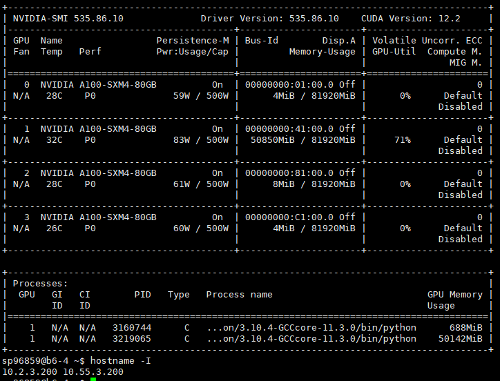

# GPUs in SAPelo
## b6-1 GPU （Ethernet：10.2.3.197；InfiB：10.55.3.197）No.1
  
## b6-2 GPU （Ethernet：10.2.3.198；InfiB：10.55.3.198）No.2
  
## b6-3 GPU （Ethernet：10.2.3.199；InfiB：10.55.3.199）No.3
  
## b6-4 GPU （Ethernet：10.2.3.200；InfiB：10.55.3.200）No.4
  
## b7-1 GPU （Ethernet：10.2.3.223；InfiB：10.55.3.223）No.5
 
## b7-2 GPU （Ethernet：10.2.3.224；InfiB：10.55.3.224）No.6
  
## b7-3 GPU （Ethernet：10.2.3.225；InfiB：10.55.3.225）No.7
  
## b7-4 GPU （Ethernet：10.2.3.226；InfiB：10.55.3.226）No.8
  
## b8-1 GPU （Ethernet：10.2.10.4；InfiB：10.55.4.1）No.9
  
## b8-2 GPU （Ethernet：10.2.10.5；InfiB：10.55.4.2）No.10
  
## b8-3 GPU （Ethernet：10.2.10.6；InfiB：10.55.4.3）No.11  
 
## b8-4 GPU （Ethernet：10.2.2.98；InfiB：10.55.2.98）No.12
 
## c5-22 GPU （Ethernet：10.2.1.116；InfiB：10.55.1.116）No.13
 
## c5-23 GPU （Ethernet：10.2.1.117；InfiB：10.55.1.117）No.14
 
## GPU nodes in Sapelo2
sinfo --Format=NodeHost,Gres | grep gpu  
a1-9(scavenge_p)    gpu:V100S:1(S:0),lsc  
a1-10(scavenge_p)   gpu:V100S:1(S:0),lsc 
a1-23(scavenge_p)   gpu:V100S:1(S:0),lsc  
a1-24(scavenge_p)   gpu:V100S:1(S:0),lsc 

b6-1                gpu:A100:4(S:0-1),ls  
b6-2                gpu:A100:4(S:0-1),ls  
b6-3                gpu:A100:4(S:0-1),ls  
b6-4                gpu:A100:4(S:0-1),ls  

b7-1                gpu:A100:4(S:0-1),ls  
b7-2                gpu:A100:4(S:0-1),ls  
b7-3                gpu:A100:4(S:0-1),ls  
b7-4                gpu:A100:4(S:0-1),ls  
   
b8-1                gpu:A100:4(S:0-1),ls  
b8-2                gpu:A100:4(S:0-1),ls  
b8-3                gpu:A100:4(S:0-1),ls 
b8-4                gpu:A100:4(S:0-1),ls  

c4-23               gpu:P100:1,lscratch:  
c5-22               gpu:P100:1(S:0),lscr    
c5-23               gpu:P100:1(S:0),lscr    
 
d1-1(scavenge_p)    gpu:V100:1(S:0),lscr  
d1-2(scavenge_p)    gpu:V100:1(S:0),lscr  
d1-3(scavenge_p)    gpu:V100:1(S:0),lscr  
d1-4(scavenge_p)    gpu:V100:1(S:0),lscr  
d1-9(Bahal)         gpu:V100:2(S:0-1),ls  
d1-10(Bahal)        gpu:V100:2(S:0-1),ls  
d1-11(Bahal)        gpu:V100:1,lscratch 

## Cuda module in Sapelo2 
Description:  
CUDA (formerly Compute Unified Device Architecture) is a parallel computing platform and programming model created by NVIDIA and implemented by the graphics processing units (GPUs) that they produce. CUDA gives developers access to the virtual instruction set and memory of the parallel computational elements in CUDA GPUs.  

     Versions:
        CUDA/10.0.130
        CUDA/10.1.243
        CUDA/11.1.1-GCC-10.2.0
        CUDA/11.2.1-GCC-8.3.0
        CUDA/11.2.1
        CUDA/11.3.1
        CUDA/11.4.1
        CUDA/11.7.0
        CUDA/12.0.0
