## b6-1 GPU （Ethernet：10.2.3.197；InfiB：10.55.3.197）No.1
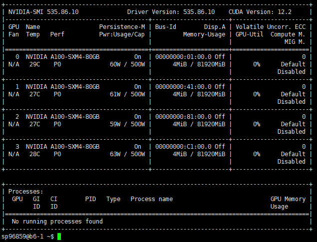  
## b6-2 GPU （Ethernet：10.2.3.198；InfiB：10.55.3.198）
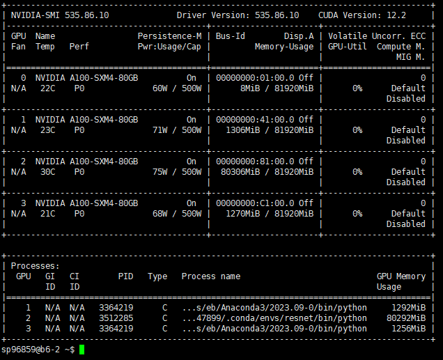  
## b6-3 GPU （Ethernet：10.2.3.199；InfiB：10.55.3.199）
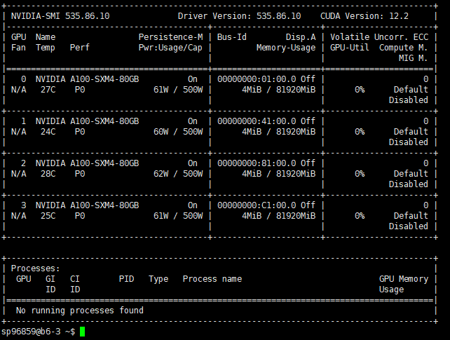  
## b7-1 GPU （Ethernet：10.2.3.223；InfiB：10.55.3.223）
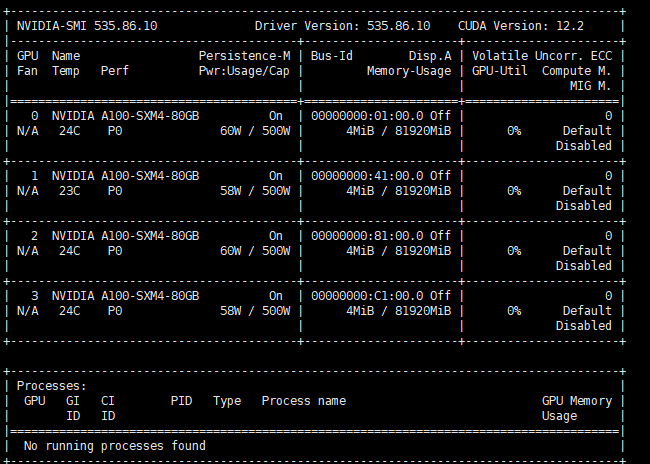 
## b7-2 GPU （Ethernet：10.2.3.224；InfiB：10.55.3.224）
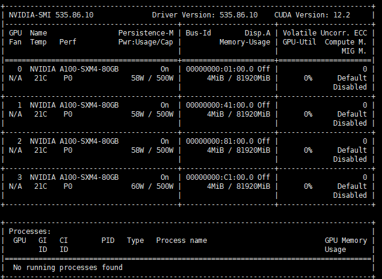  
## b7-3 GPU （Ethernet：10.2.3.225；InfiB：10.55.3.225）
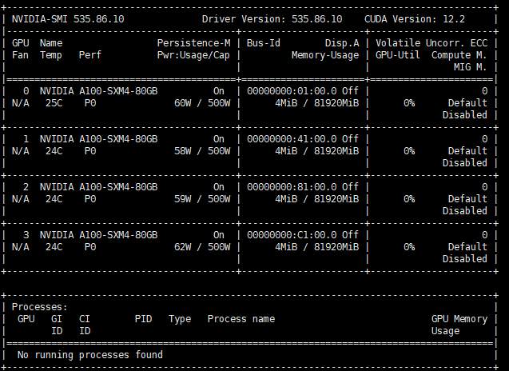  
## b7-4 GPU （Ethernet：10.2.3.226；InfiB：10.55.3.226）
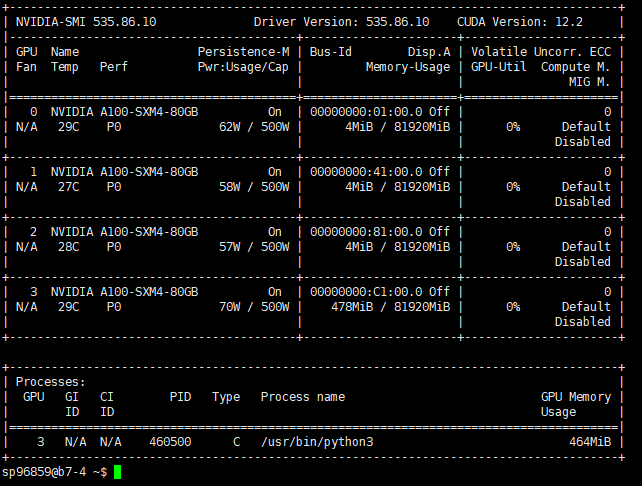  
## b8-1 GPU （Ethernet：10.2.10.4；InfiB：10.55.4.1）
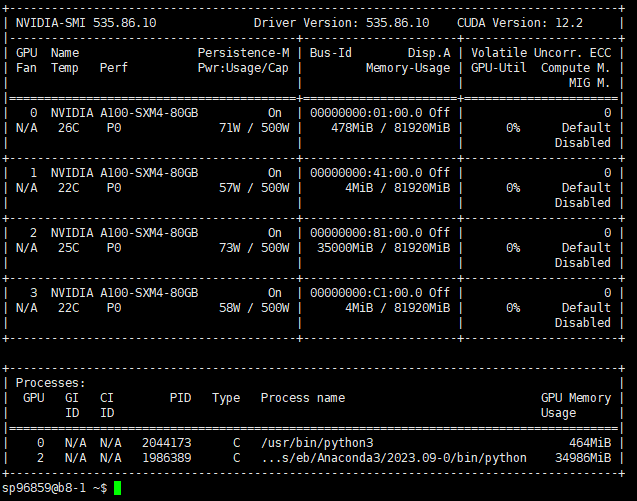  
## b8-2 GPU （Ethernet：10.2.10.5；InfiB：10.55.4.2）
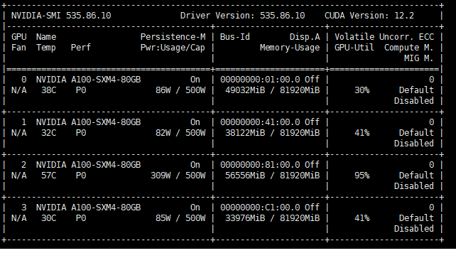  
## b8-3 GPU （Ethernet：10.2.10.6；InfiB：10.55.4.3）
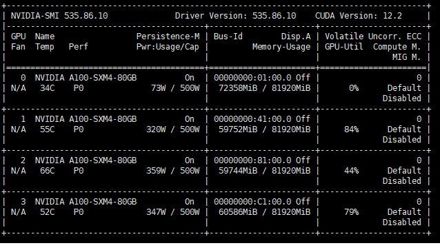 
## b8-4 GPU （Ethernet：10.2.2.98；InfiB：10.55.2.98）
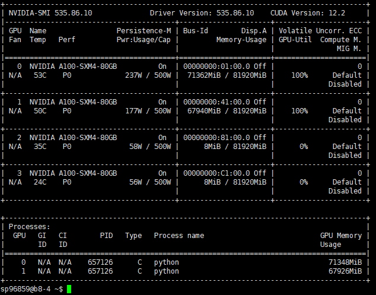 
## c5-22 GPU （Ethernet：10.2.1.116；InfiB：10.55.1.116）
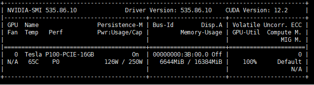 
## c5-23 GPU （Ethernet：10.2.1.117；InfiB：10.55.1.117）
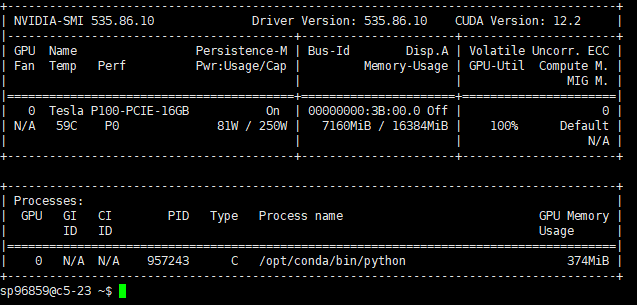 
